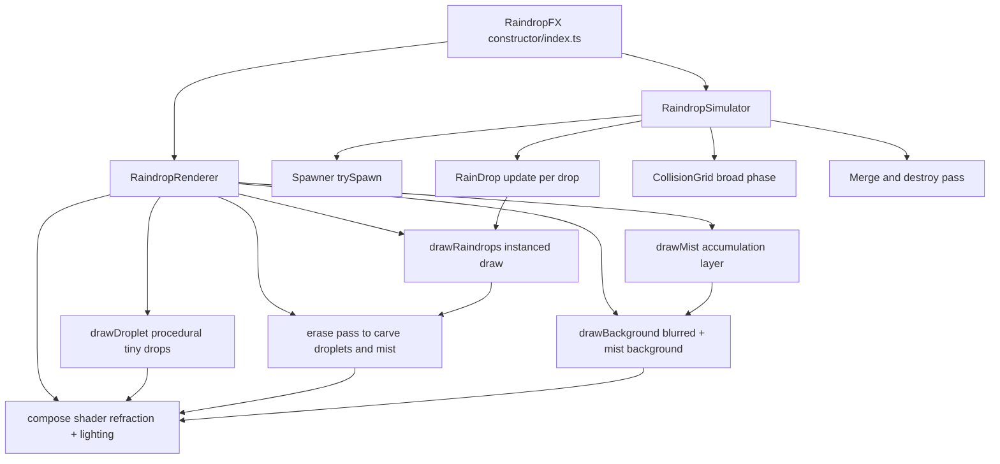

# RaindropFX Archaeology: Stage A/B Findings (2026-03-15)

## Scope and evidence

This document is based on direct source inspection of the frozen upstream snapshot integrated in this workspace.

Primary code evidence:
- `src/reference/frozen/raindrop-fx/src/index.ts`
- `src/reference/frozen/raindrop-fx/src/simulator.ts`
- `src/reference/frozen/raindrop-fx/src/raindrop.ts`
- `src/reference/frozen/raindrop-fx/src/spawner.ts`
- `src/reference/frozen/raindrop-fx/src/renderer.ts`
- `src/reference/frozen/raindrop-fx/src/blur.ts`
- `src/reference/frozen/raindrop-fx/src/shader/*.glsl`
- `src/reference/reference-baseline.ts` (workspace integration and behavior profile)

Confidence labels used below:
- High: directly stated by code path and data flow.
- Medium: inferred from implementation but not explicitly documented upstream.

## A. Major subsystems and data flow map

### A1. System-level map

### A2. Subsystem inventory

| Subsystem | What it does | Main inputs | Main outputs | Visible influence | Perf profile |
|---|---|---|---|---|---|
| Runtime orchestrator (`index.ts`) | Owns simulator + renderer lifecycle; frame callback | Canvas, options, requestAnimationFrame time | Per-frame simulation update and render call | Global cadence and option plumbing | Low CPU overhead |
| Spawner (`spawner.ts`) | Emits new large drops over time + helper for trail drops | `spawnInterval`, `spawnSize`, viewport, dt | New `RainDrop` objects | Density and size distribution of primary drops | Low to medium CPU |
| Drop state and physics (`raindrop.ts`) | Per-drop motion, evaporation, spread deformation, trail splitting, merge momentum | Gravity, slip/motion params, trail params, dt | Updated drop pos/size/velocity/spread; spawned trail drops | Core drop motion language, runner-like behavior | High CPU at scale |
| Broad-phase collision (`simulator.ts`) | Uniform grid partition and neighborhood pair checks | Drop positions/sizes, collider size | Merge events and destroy flags | Coalescence frequency and larger drops | High CPU at high drop counts |
| Renderer pass graph (`renderer.ts`) | Multi-target render pipeline and final compose | Drops, options, background textures, dt | Final frame pixels | Refraction, mist look, edge smoothness, specular/diffuse look | Main GPU cost center |
| Blur chain (`blur.ts`) | Multi-step downsample/upsample blur for background and mist background | Background texture, blur steps | `blurryBackground`, `mistBackground` | Defocus strength and mist softness | Medium to high GPU depending on steps |
| Procedural tiny droplet pass (`droplet-vert.glsl` + `droplet.glsl`) | Instanced random micro droplets each frame | Spawn rect, size range, random seed, rate | Additive droplet normal/alpha contribution | Fine-grain bead noise and sparkle | Medium GPU fill + instance cost |
| Final compose shader (`compose.glsl`) | Combines large-drop + tiny-drop + mist with refraction and lighting | Raindrop texture, droplet texture, mist, blurred background, lighting uniforms | Final composited color/alpha | Refractive distortion and lighting realism | Medium GPU shader cost |

## B. How a frame is generated (input state -> pixels)

### B1. Initialization and entry points

1. `RaindropFX` builds default options and constructs simulator and renderer.
2. `start()` loads textures/background assets, then begins requestAnimationFrame loop.
3. Each frame builds a `Time` object and calls `update()`.

Important observed behavior:
- The loop currently forces `dt` to a constant `0.03` in `index.ts`, while using real wall time only for `time.total`. This is deterministic-like stepping but not fixed to display refresh and may bias motion speed.

### B2. Simulation path (CPU)

Per update in `RaindropSimulator.update(time)`:
1. Spawn new drops while current time exceeds next spawn threshold.
2. Update every live drop (`updateRaindrop`):
- Randomly refresh motion resistance and x-shift on an interval window.
- Evaporate mass continuously.
- Integrate velocity and position under gravity minus resistance.
- Deform spread based on velocity and shrink over time.
- Emit trail drops once travel distance exceeds threshold.
3. Re-bin drops in uniform collision grid based on world position.
4. Check neighboring 3x3 cells for overlaps and merge by mass priority.
5. Remove destroyed drops.

### B3. Render path (GPU)

Per frame in `RaindropRenderer.render(raindrops, time)`:
1. `drawDroplet(time)`: procedural instanced tiny droplets are drawn into `dropletTexture`.
2. `drawMist(dt)`: mist texture accumulates over time (`dt / mistTime`).
3. `drawRaindrops(raindrops)`: large drops are instanced into `raindropComposeTex`.
4. Erase pass copies `raindropComposeTex` into droplet/mist targets with edge smoothing, effectively clearing/reshaping where large drops pass.
5. Background pass draws pre-blurred background and optional mist-tinted background layer.
6. Final compose shader:
- Reads raindrop and tiny droplet textures.
- Uses combined channels as pseudo-normal/refraction map.
- Refracts blurred background UV.
- Applies diffuse + specular lighting.
- Outputs alpha masked by smoothed drop coverage.

Result: the effect is a hybrid of CPU droplet simulation plus shader compositing. There is no shared wet-surface state field in this architecture.

## C. Most visually important tunable parameters (first-pass priority)

The list below is ranked by observed likely impact from code path.

1. `spawnInterval`, `spawnSize`, `spawnLimit`
- Controls scene occupancy, drop scale distribution, and merge opportunities.

2. `slipRate`, `motionInterval`, `xShifting`, `gravity`
- Controls movement cadence, stop/start feel, diagonal drift, and acceleration character.

3. `trailDistance`, `trailDropSize`, `trailDropDensity`, `trailSpread`
- Controls runner/trail breakup frequency, trailing bead size, and trail thickness decay.

4. `evaporate`, `shrinkRate`, `velocitySpread`, `initialSpread`
- Controls lifecycle duration, elongation/narrowing profile, and edge deformation.

5. `colliderSize`
- Controls coalescence frequency and emergence of larger heavy drops.

6. `dropletsPerSeconds`, `dropletSize`
- Controls fine surface peppering/noise and perceived wetness density.

7. `smoothRaindrop`, `raindropEraserSize`
- Controls drop edge softness and blend transition quality.

8. `refractBase`, `refractScale`
- Controls optical distortion strength and scale response by drop size.

9. `backgroundBlurSteps`, `mistBlurStep`, `mist`, `mistTime`, `mistColor`
- Controls atmospheric haze density/softness and background depth feel.

10. `raindropCompose`, `raindropLightPos`, `raindropDiffuseLight`, `raindropSpecularLight`, `raindropSpecularShininess`, `raindropShadowOffset`, `raindropLightBump`
- Controls highlight/shadow style and whether droplets read as smooth gel vs hard overlays.

Workspace baseline profile currently sets a curated subset in `applyBehaviorProfile`.

## D. Fundamental mechanics vs polish

### D1. Likely fundamental (for recognizable behavior)

- CPU drop simulation with evaporation + gravity/resistance random motion intervals.
- Trail split mechanic tied to travel distance.
- Merge mechanic based on overlap in neighborhood search.
- Final refraction compose that uses generated drop fields as distortion normal proxy.

### D2. Likely polish (can vary without breaking core identity)

- Mist color tint and exact mist blur depth.
- Specular terms and shininess tuning.
- Smoother vs harder blend style.
- Background art treatment and blur amount.

## E. First-pass viability for deep extension (MistyOS-oriented)

Judgment: Partial donor/reference, not yet a direct foundation for broad MistyOS goals.

Why:
- Strengths
- Readable TypeScript + GLSL source, clear module boundaries, practical real-time performance orientation.
- Existing options are rich and directly tied to visible behavior.
- Good for reproducing this specific glass-raindrop visual family.

- Risks and blockers for being the sole foundation
- Architecture is object-per-drop CPU simulation, which may not scale to larger interaction scope or heavier scene coupling.
- Randomness uses `Math.random` in source paths; deterministic replay guarantees require extra control wrapping.
- No canonical shared wet-surface field; behavior is built from droplets + compositing, not a general physically unified surface state.
- Current loop hard-codes simulation dt in `index.ts`; this simplifies behavior consistency but obscures physical timing portability.
- Mist is an accumulated render-layer effect, not a fluid simulation subsystem.

Interpretation:
- Strong donor/reference for behavior language, parameter sensitivity, and visual pipeline ideas.
- For MistyOS-scale extensibility, likely needs a reconstruction path that keeps proven visual tricks but replaces/augments core state model and determinism plumbing.

## F. Controlled experiment plan (next step, Stage C)

Goal: Build evidence-backed variable-to-effect map against the real baseline implementation.

### F1. Experiment structure

- One-change-per-run rule.
- Fixed preset, resolution, and capture window per batch.
- Save run metadata with: parameter changed, old value, new value, rationale, visible deltas, perf deltas.

Suggested artifact paths:
- `tools/logs/behavioral-exp/` for JSON run records.
- `tools/logs/behavioral-exp/screens/` for baseline vs modified snapshots.
- `docs/architecture/raindropfx-variable-effect-map.md` for cumulative interpretation.

### F2. First experiment matrix (high impact first)

Batch 1 (motion language):
- `slipRate`: [0.55, 0.74, 0.9]
- `motionInterval`: widen/narrow interval
- `gravity`: [1800, 2400, 3000]

Batch 2 (trail and merge identity):
- `trailDistance`: short vs long
- `trailDropSize`
- `colliderSize`

Batch 3 (optical signature):
- `refractBase`, `refractScale`
- `smoothRaindrop`
- `raindropCompose`

Batch 4 (atmosphere and cost):
- `dropletsPerSeconds`
- `backgroundBlurSteps`, `mistBlurStep`
- `mistTime`

### F3. Execution using existing tooling

- Use current baseline page for qualitative visual checks.
- Use existing evaluator/watchdog scripts for repeatable timing and sampled-structure metrics.
- Avoid candidate-engine tuning loops unless a specific baseline hypothesis needs contrast testing.

## G. Open unknowns to resolve in Stage C/D

- Exact performance envelope on modest integrated GPUs at target resolution under heavy parameter regimes.
- Whether deterministic controls can be fully guaranteed without forking or wrapping randomness/time at source.
- How far this architecture can stretch toward interactive disturbance semantics before requiring a state-model redesign.
